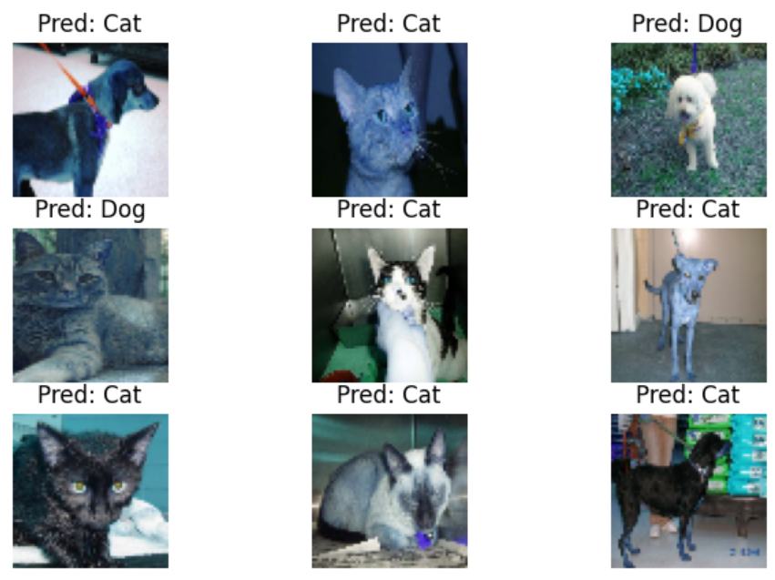

# PRODIGY_ML_03 - Cats vs Dogs Classification with Support Vector Machine (SVM)

This project is part of the **Machine Learning Internship** offered by **Prodigy InfoTech**.

---

## 📊 Task Objective

Implement a **Support Vector Machine (SVM)** classifier to distinguish between images of **cats** and **dogs** using the [Kaggle Dogs vs Cats dataset](https://www.kaggle.com/c/dogs-vs-cats/data).

---

## 📌 Dataset Source
**Kaggle:** [Dogs vs Cats](https://www.kaggle.com/c/dogs-vs-cats/data)

---

## 🔧 Tools & Libraries Used

- Python 🐍
- OpenCV
- NumPy
- Matplotlib
- Scikit-learn
- Google Colab
- Kaggle API

---

## 📈 Approach

- Downloaded and extracted the dataset from Kaggle  
- Loaded images and resized them to a smaller fixed size for efficient SVM training  
- Converted images to **color format** and normalized pixel values  
- Flattened image arrays for SVM input  
- Split dataset into training and testing sets  
- Trained a **Support Vector Classifier (SVC)** model  
- Evaluated performance using **accuracy score**  
- Visualized predictions on random test images  

---

## ✅ Results

- Achieved classification accuracy of **0.67** on test data  
- Successfully predicted labels for unseen images  

---

## 📁 Files

- `PRODIGY_ML_03.ipynb` → Full implementation notebook  
- `README.md` → Project overview  
- `images/sample_predictions.png` → Output visualization  

---

## 🔗 Open in Google Colab

])

---

## 🚀 Output Preview

---

## 📚 Learning Outcomes

- Learned how to apply **SVM** to an image classification problem  
- Understood preprocessing techniques for image-based ML models  
- Improved skills in **dataset handling** and **model evaluation**  

---

## 📝 Note

✅ This repository is maintained as part of the **Prodigy InfoTech Machine Learning Internship**.

